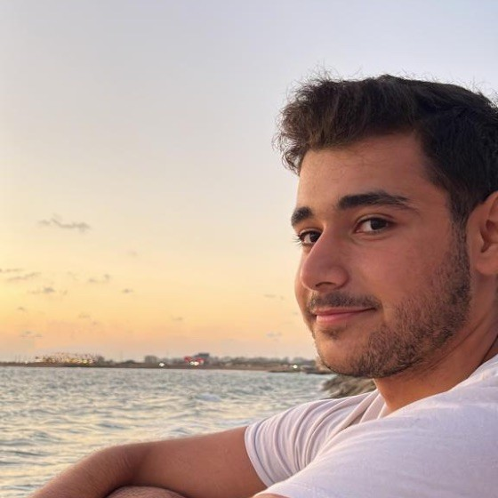

## About me

  
  

    My name is Mohammad Massri, and I’m a software engineer with a deep obsession for software engineering and Linux. 
    My passion extends to systems design and development, and I’m currently aiming for software management roles in the short term. 
    My long-term goal is to become a CTO 🚀
  

 

  <a href="https://mouhamaddev.github.io/mouhamaddev/resume.html" style="text-decoration:none;"><!--https://drive.google.com/file/d/1JsHFiupaxvGCN8JjpLnxKrRqlhYzWfLQ/view?usp=sharing-->
    <button style="padding:10px 15px; font-size:14px; color:white; background-color:#007BFF; border:none; border-radius:5px; cursor:pointer;">
      Take Me to my Resume &nbsp; 🖥️
    </button>
  </a>

  <a href="https://mouhamaddev.github.io/Code-Memo/" style="text-decoration:none;">
    <button style="padding:10px 15px; font-size:14px; color:white; background-color:#007BFF; border:none; border-radius:5px; cursor:pointer;">
      Take Me to Code Memo &nbsp; ✏️
    </button>
  </a>

  <a href="https://pypi.org/project/ascibar/" style="text-decoration:none;">
    <button style="padding:10px 15px; font-size:14px; color:white; background-color:#007BFF; border:none; border-radius:5px; cursor:pointer;">
      Check out Ascibar &nbsp; 🐍
    </button>
  </a>

